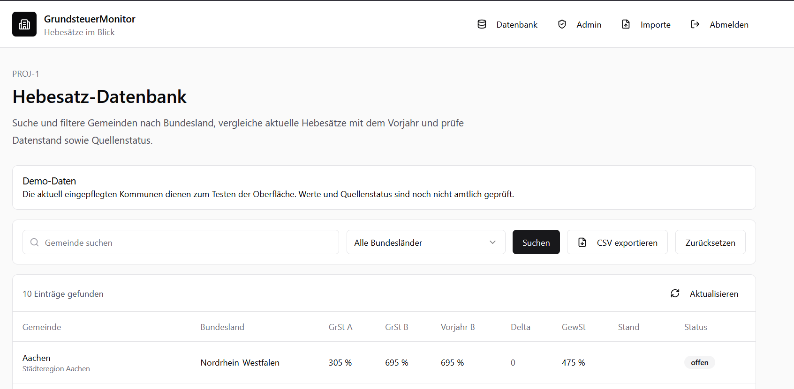

# Grundsteuer-Monitor

> Bundesweite Transparenz für kommunale Hebesätze (Grundsteuer A, Grundsteuer B, Gewerbesteuer) — Datenbank, Vergleich, Import-Pipeline und Export. Next.js 16 + Supabase.

**Live-Demo:** https://grundsteuer-app.vercel.app



---

## Worum es geht

Hebesätze deutscher Kommunen sind öffentlich, aber zersplittert: Amtsblätter, Statistikämter, Kommunal-Webseiten. Wer Standortentscheidungen trifft, Mandanten berät oder Bestände bewertet, sucht heute manuell zusammen, was eigentlich eine Datenbank-Abfrage sein sollte.

Der Grundsteuer-Monitor zentralisiert das: gepflegte Hebesatz-Datenbank für alle 16 Bundesländer, Vergleich, Watchlist mit Änderungs-Alerts, CSV/Excel-Export.

**Zielgruppen:** Steuerberater, Immobilieninvestoren, Kommunen, Mittelstand.

**USP:** Änderungen bei Grundsteuer- und Gewerbesteuer-Hebesätzen automatisch überwachen, vergleichen und als Excel-Auswertung für Mandanten oder Immobilienportfolios nutzen.

---

## Tech-Stack

| Layer | Tool |
|-------|------|
| Framework | Next.js 16 (App Router), TypeScript |
| Styling | Tailwind CSS + shadcn/ui |
| Backend | Supabase (PostgreSQL, Auth, Row Level Security) |
| Validierung | Zod + react-hook-form |
| Deployment | Vercel |
| Workflow | Claude Code Skill Pipeline |

---

## Features (Stand)

| ID | Feature | Status |
|----|---------|--------|
| PROJ-1 | Bundesweite Hebesatz-Datenbank — suchbar, filterbar, paginiert | ✅ MVP |
| PROJ-4 | Import-Pipeline — Admin-CSV-Upload mit Staging, Row-Validierung, Approval-Workflow, Audit-Trail | ✅ MVP |
| PROJ-5 | CSV/Excel-Export der Municipality-Daten | ✅ MVP |
| PROJ-2 | Watchlist + Änderungs-Alerts | 📋 Geplant |
| PROJ-3 | SEO-Stadtseiten | 📋 Geplant |
| PROJ-6 | Renditeauswirkungs-Rechner | 📋 Geplant |

Detaillierte Specs pro Feature unter [`features/`](features/). Übersicht: [`features/INDEX.md`](features/INDEX.md).

---

## Lokales Setup

**Voraussetzungen:** Node.js 20+, ein Supabase-Projekt (kostenloser Free-Tier reicht).

```bash
git clone https://github.com/investorthm-ops/Grundsteuer-app.git
cd Grundsteuer-app
npm install

# Env-Vars setzen
cp .env.local.example .env.local
# .env.local mit Supabase-URL und Anon-Key füllen

# Migrationen anwenden (Supabase CLI)
supabase db push

# Optional: Seed-Daten für Demo-Municipalities
psql <connection-string> -f supabase/seed_demo_municipalities.sql

npm run dev
```

App läuft auf http://localhost:3000.

---

## Architektur-Highlights

- **Row Level Security statt Service-Role-Key.** Server-side-Zugriffe gehen über die User-Session via `@supabase/ssr`. Autorisierung wird durch RLS + `user_roles`-Tabelle erzwungen. Kein Bypass-Pfad.
- **Import-Staging.** CSV-Uploads landen zuerst in `import_runs` + `import_rows`, werden validiert (Pflichtfelder, Bundesland-Whitelist, Hebesatz 0–2000, Delta-Flagging), und müssen pro Run vom Admin approved werden, bevor sie in die Live-Tabelle wandern.
- **Audit-Trail.** Jeder Import-Run trägt Quelle, Datum, ausführender User, Resultat-Counts.

Architektur-Diagramm: [`diagrams/grundsteuer-monitor-projektueberblick.png`](diagrams/grundsteuer-monitor-projektueberblick.png).

---

## Über das Projekt

Das ist ein **Lern- und Portfolio-Projekt** eines Solo-Entwicklers (Markus, SAP-Berater, Selbstständigkeit nebenher). Ziel ist nicht primär kommerzielle Skalierung, sondern:

1. Eine reale Domäne mit Tiefe (Steuerrecht, Datenpflege) ernsthaft durcharbeiten.
2. Den Claude-Code-Skill-Pipeline-Workflow (`/requirements` → `/architecture` → `/backend` → `/frontend` → `/qa` → `/deploy`) an einem nicht-trivialen Beispiel testen.
3. Einen sauberen Next.js + Supabase Tech-Stack tief verstehen.

Pull Requests, Feedback und Diskussionen sind willkommen.

---

## Legacy-Artefakte

Im Repo-Root finden sich noch ältere HTML-MVPs und Pitch-Unterlagen aus der Vor-Phase (`Grundsteuer-Monitor-MVP.html`, `Grundsteuer-Monitor-Pitch.pdf`, ...). Diese sind historisch und werden nicht mehr gepflegt. Die aktuelle Implementation ist die Next.js-App unter [`src/`](src/).

---

## Lizenz

MIT — siehe [LICENSE](LICENSE).
